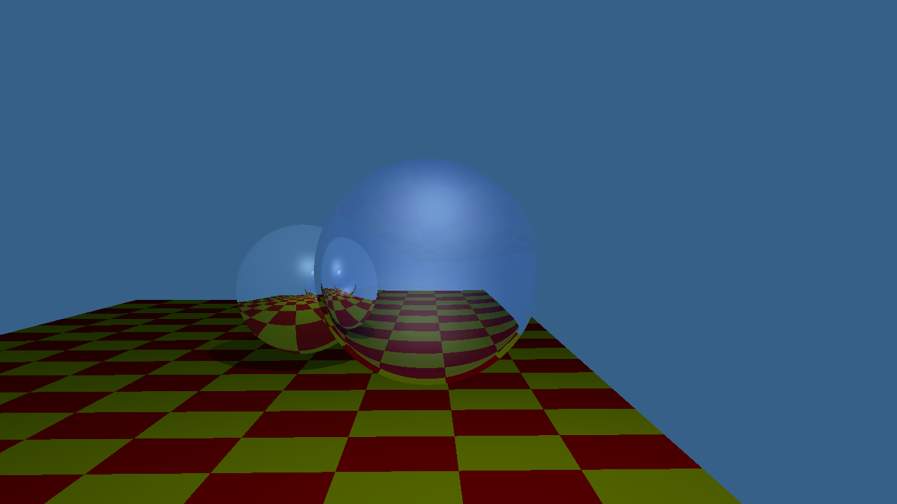
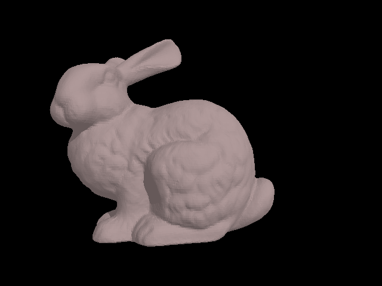
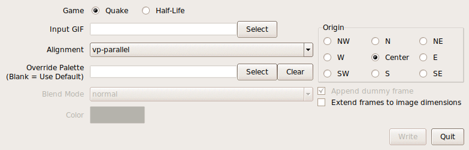
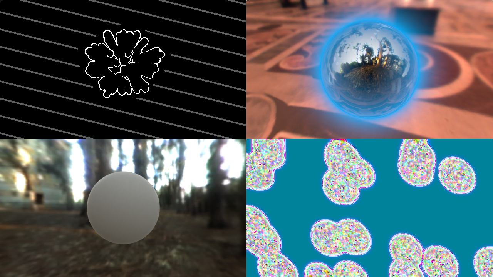
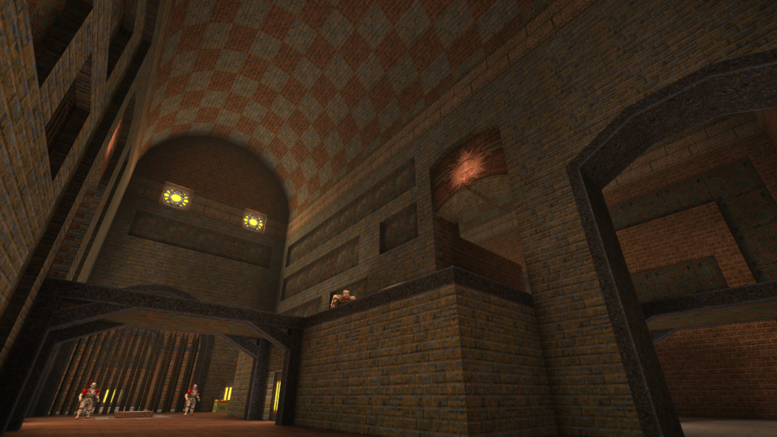
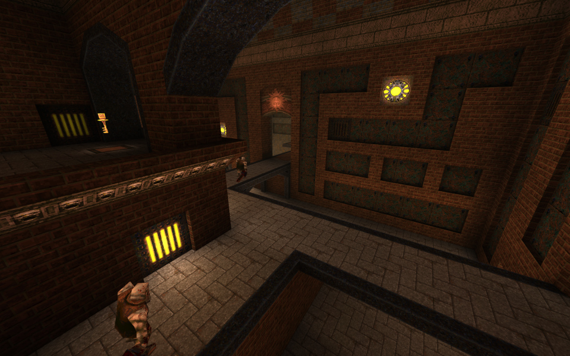
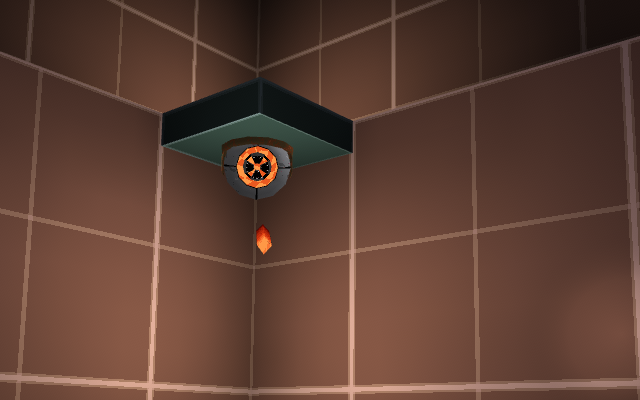
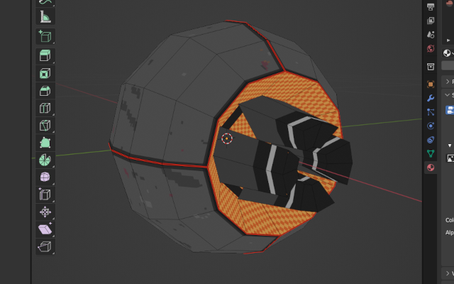
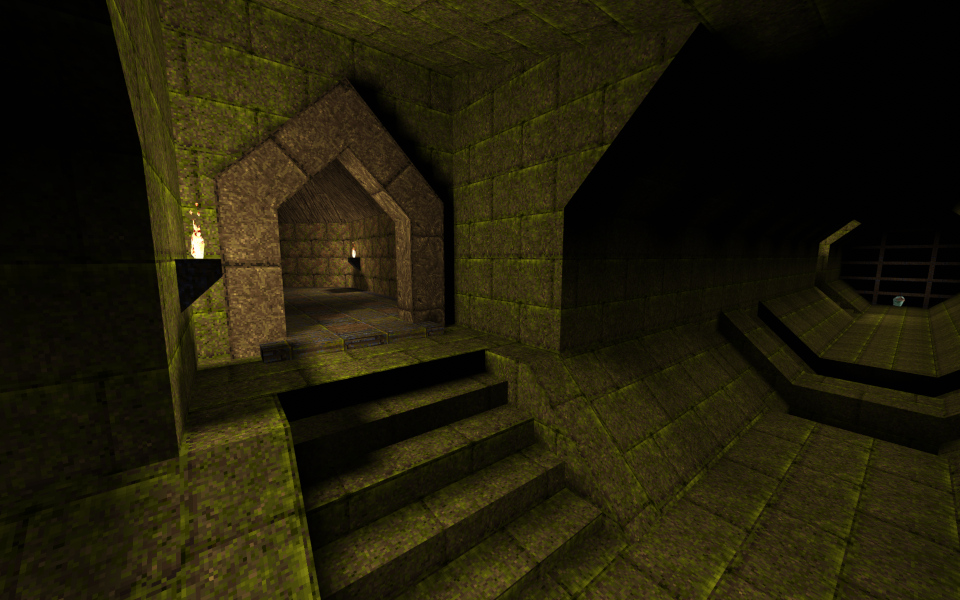
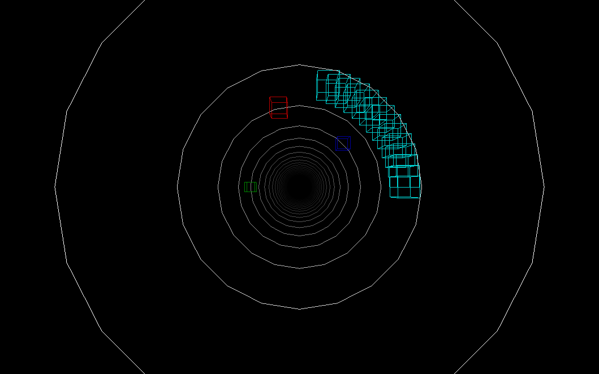

# Portfolio

Seth Rader

[GitHub](https://github.com/4LT) \|
[LinkedIn](https://www.linkedin.com/in/seth-rader-50b81996)

## Software Ray Tracer

### Pipeline

<https://github.com/4LT/GI>

Full rendering pipeline converting a scene description to pixel buffer.
Includes global illumination techniques for reflection, refraction, and shadow
rays.

### K-d Tree

<https://github.com/4LT/GI>

Scene optimization using K-dimensional tree resulting in 150x speed-up on render
of "Stanford Bunny".  Conventionally, scene would be bisected in X/Y/Z direction
by round-robin; I opted for a heuristic selecting X, Y, or Z to minimize the
number of duplicated triangles.  For each dimension, planes are placed at the 
median of the triangle centroids in that dimension.

## gif2spr

<https://github.com/4LT/gif2spr>

CLI and GUI application for converting animated .gif (GIF89) images to Quake and
Half-Life sprites.  GUI is an easy-to-use front-end over the CLI built with
Tcl/Tk.

## ShaderToy Shaders

<https://www.shadertoy.com/user/4LT>

Experiments with visual feedback effects, ray tracing, SDFs, image-based
lighting, animation, and audio visualization.

## Quake Maps/Modding

Quake 1 singleplayer map and scripting contributions.

### Askisi Gamma

<https://www.slipseer.com/index.php?resources/askisi-gamma.94/>

Medium-sized tiered structure with a mixture of custom-made and stock Quake
textures.  Leverages Copper mod to create more engaging encounters and simplify
scripted events.  Built with TrenchBroom.

### Mod Jam 2022 Contribution: Leading Shot Turrets

<https://www.slipseer.com/index.php?resources/modding-jam-2022.186/>

Quake mod that implements turrets which fire ahead of their targets by a
distance determined by projectile and target velocity.  "Ball turret" modeled
and UV mapped in Blender.

### Quake 25th Anniversary Contribution: Grotto Gristle

<https://www.quaddicted.com/reviews/q25_limits_v1.2.html>

Homage to Quake's e1m4, "The Grisly Grotto".  Features riffs on the original
map's traps to make them more lethal.

## Pipe Cleaner (WIP)

<https://github.com/4LT/pipe-cleaner>

Wireframe shoot-em-up wherein ships are flown on the inside surface of a
cylinder.  So far only a renderer is implemented with minimal input support.
Renderer serves as an abstraction over the Rust
[wgpu](https://crates.io/crates/wgpu) library, and leverages instanced rendering
to reduce draw calls.
